# RationaleOps Development Plan

> **Tagline:** Turn hidden data logic into living decisions.
>
> **Core line:** Every strange filter is a rule, a workaround, or a bug. Ask before you automate.
>
> **Positioning:** A Cognitive Task Analysis agent for business logic hidden in enterprise data pipelines.
>
> **Challenge category:** Agents That Do Real Work
>
> **Status:** Selected direction — July 23, 2026

Related documents:

- [Hackathon requirements and judging criteria](docs/HACKATHON_BRIEF.md)
- [User pain and cross-disciplinary research](docs/USER_PAIN_RESEARCH.md)

## 1. Executive Summary

DataHub can show which tables, columns, filters, joins, and downstream assets are involved in a SQL query. It usually cannot explain why the organization chose that logic.

Consider:

```sql
WHERE activity_at >= current_date - interval '37 days'
  AND country_code <> 'DE'
  AND account_status NOT IN ('trial', 'refunded')
```

The code alone cannot reliably answer:

- Is 37 days an approved settlement grace period or a typo for 30?
- Is excluding Germany a permanent policy or an expired workaround?
- Are `trial` and `refunded` both part of the official active-customer definition?
- Which exceptions change the rule?
- Who approved it, when did it take effect, and when should it be reviewed?

RationaleOps uses the DataHub graph to find high-impact SQL decision points that lack a trustworthy rationale. Instead of inventing an explanation, the LLM agent applies Cognitive Task Analysis and the Critical Decision Method to interview the actual data owner. It adaptively probes cues, goals, alternatives, exceptions, and counterfactuals.

After human confirmation, RationaleOps produces:

- A DataHub-linked Decision Contract.
- A glossary or Context Document update proposal.
- A dbt or SQL acceptance test.
- A safe code-repair proposal for an expired workaround.
- Explicit ownership, effective dates, expiry conditions, and review triggers.

The confirmed result is written back to DataHub so future people and agents can retrieve not only `WHAT` the system does but also the authorized `WHY`.

### Elevator pitch

> RationaleOps finds the highest-impact business decisions hidden in SQL, interviews the people who understand them, and turns confirmed rationale into living DataHub context, executable tests, and safe code repairs.

## 2. Why an LLM Is Necessary

Deterministic automation can:

- Parse a SQL AST.
- Find magic numbers, hard-coded exclusions, `CASE` branches, and unusual joins.
- Calculate downstream reach, usage, and ownership from DataHub.
- Compare glossary definitions, documentation, and implementation.

It cannot answer from existing metadata alone:

- Is this an official policy or a temporary workaround?
- Does the Finance grace period include prepaid accounts?
- Should a customer who settles on day 31 be included?
- When someone says “temporary,” what date or event ends it?
- If the owner's answer conflicts with the glossary, which source is authoritative?

### Essential LLM responsibilities

1. Explain a complex SQL decision point in language its owner understands.
2. Ask adaptive follow-up questions based on the owner's previous answer.
3. Interpret vague language, domain terminology, exceptions, temporal scope, and contradictions.
4. Generate alternative hypotheses while clearly marking them as unverified.
5. Use counterfactual probes to test the boundary of a rule.
6. Map the conversation into a typed Decision Contract draft.
7. Connect one decision to glossary terms, SQL fragments, DataHub assets, and downstream effects.
8. Draft a test or repair and hand it to deterministic tools for validation.

### Correctness boundary

> **The LLM discovers questions and structures answers. Humans authorize intent. Code verifies implementation.**

The LLM must never:

- Present an inferred rationale as fact.
- Approve a business rule on behalf of an owner or steward.
- Publish an explanation merely because it sounds plausible.
- Modify production code or authoritative metadata without explicit approval.

## 3. Cross-Disciplinary Design: Cognitive Task Analysis

### Source method

The Critical Decision Method is not a generic exit interview. It examines a specific critical incident in multiple passes:

1. Build the event and decision timeline.
2. Identify critical decision points.
3. Probe the cues, goals, expectations, and alternatives present at each point.
4. Ask counterfactual questions such as “Would the decision change if X were different?”
5. Structure the expert's tacit knowledge.

### Data-engineering mapping

```text
DataHub lineage + query history = flight or event recorder
Non-obvious SQL predicate       = critical decision point
Data owner                      = subject-matter expert
LLM agent                       = cognitive investigator
Decision Contract               = confirmed investigation record
dbt test or code patch          = operational recommendation
```

RationaleOps does not attempt to infer the complete truth from code. An accident investigator cannot infer pilot intent from a flight recorder alone; the recorder is evidence used to guide a precise, auditable interview.

## 4. Product Problem

> Which high-impact data transformations contain decisions the organization can execute but can no longer explain?

### Why this is not another lineage map

DataHub already uses connectors, query history, and SQL parsing to create and display table- and column-level lineage. RationaleOps neither redraws that graph nor presents upstream and downstream visibility as a new feature.

The graph is only a **risk radar**. It identifies the blast radius, usage, and likely owner of a SQL fragment. The new work starts after lineage:

```text
DataHub already provides:
A particular SQL fragment connects A to B, C, and D.
WHAT / WHERE

RationaleOps adds:
Why 37 days, who approved it, which exceptions apply, and when it expires.
WHY / AUTHORITY / LIFECYCLE
```

Even with perfectly captured lineage:

- Identical-looking filters may be policies, temporary workarounds, or accidental bugs.
- A SQL parser can locate a predicate but cannot derive its original business intent from syntax.
- Existing glossary content may be missing, stale, or contradicted by an owner.
- Automatically generated prose cannot safely replace confirmation by an authorized person.
- Context without expiry, tests, and review triggers will decay again.

The hero demo must therefore continue beyond the graph: locate a high-risk decision point, elicit a previously unknown exception or expiry condition, obtain human confirmation, generate and verify a test or patch, and write the result back to DataHub. A lineage visualization alone does not satisfy the Definition of Done.

### Knowledge risk

```text
knowledge_risk =
  downstream_impact
  × usage_criticality
  × rationale_ambiguity
  × ownership_fragility
  × staleness
```

### Finding types

1. **Undocumented Decision:** implementation is clear, but rationale, ownership, or scope is missing.
2. **Contradictory Decision:** SQL, glossary, dashboard documentation, or different owners disagree.
3. **Expired Decision:** rationale contains an expiry condition, but the implementation remains active.

## 5. Hero Demo

### Scenario

The executive `active_revenue` dashboard depends on a model with 47 downstream assets. RationaleOps highlights three SQL fragments:

```sql
activity_at >= current_date - interval '37 days'
country_code <> 'DE'
account_status NOT IN ('trial', 'refunded')
```

They are syntactically similar filters but represent different business situations.

### Adaptive interview

#### Decision A — 37 days

Agent:

> The glossary says “active within 30 days,” but production SQL uses 37. Was 37 chosen deliberately? What event led to that decision?

Owner:

> Finance added a seven-day settlement grace period after late card captures caused monthly under-reporting.

Agent follow-up:

> Does the grace period apply to prepaid accounts, and what signal identifies them?

Owner:

> No. Prepaid accounts use `billing_type = 'prepaid'` and remain on 30 days.

Outcome: a confirmed rule, a Decision Contract, a glossary proposal, and a dbt test.

#### Decision B — Germany exclusion

Agent:

> I found no current glossary rule for excluding Germany. Was this intended to be temporary? What would make it safe to remove?

Owner:

> It was a temporary legal hold until the EU billing migration completed. That completed last month.

Outcome: an expired workaround with a code-removal patch and an impact-aware validation plan.

#### Decision C — Trial and refund exclusion

The owner confirms that the exclusion is part of the official active-customer definition, but the dashboard description is stale.

Outcome: preserve the code, update the glossary and Context Document, and link every downstream dashboard.

### Three-minute script

| Time | Screen and action |
|---|---|
| 0:00–0:15 | Show the three unusual filters and ask: “Policy, workaround, or bug? The code cannot tell you.” |
| 0:15–0:35 | Use DataHub to reveal 47 downstream assets, ownership, and usage; rank the three rules as the highest knowledge risks. |
| 0:35–1:25 | Run a live adaptive interview. Each answer causes an exception or counterfactual follow-up, while a decision map appears. |
| 1:25–1:50 | Reveal three cards: `CONFIRMED RULE`, `EXPIRED WORKAROUND`, and `DOCUMENTATION DRIFT`. |
| 1:50–2:15 | Generate a Decision Contract, dbt test, glossary diff, and code patch; approve each action explicitly. |
| 2:15–2:40 | Validate the prepaid exception and run a sample regression against the Germany-filter patch. |
| 2:40–2:55 | Show the linked rationale, owner, expiry, review status, and evidence in DataHub for all 47 downstream assets. |
| 2:55–3:00 | Close with: “DataHub knows where your data came from. RationaleOps preserves why it works that way.” |

## 6. Agent Workflow

```mermaid
flowchart LR
    A["DataHub queries, lineage, schema, glossary"] --> B["Deterministic decision-point miner"]
    B --> C["Knowledge-risk ranking"]
    C --> D["RationaleOps LLM agent"]
    D --> E["CTA / CDM adaptive interview"]
    E --> F["Human-confirmed Decision Contract"]
    F --> G["Test, documentation, or repair proposal"]
    G --> H["Human approval"]
    H --> I["Deterministic execution and validation"]
    I --> J["DataHub write-back"]
    J --> K["Expiry and drift revalidation"]
```



```text
Detect → Prioritize → Hypothesize → Interview → Confirm → Operationalize → Verify → Preserve
```

## 7. DataHub Integration

### MCP and Agent Context Kit reads

| DataHub capability | RationaleOps use |
|---|---|
| `get_dataset_queries` | Retrieve production SQL, filters, joins, `CASE` expressions, and usage evidence |
| `get_lineage` | Calculate downstream blast radius |
| `get_lineage_paths_between` | Connect a decision point to specific dashboards and models |
| `get_entities` | Read descriptions, owners, tags, terms, and properties |
| `list_schema_fields` | Validate referenced columns and types |
| Search | Find related glossary terms, similar assets, and possible duplicate rules |

### DataHub writes

- Create or update a linked Context Document or equivalent documentation aspect.
- Submit a glossary-definition proposal.
- Store structured properties for decision status, owner, effective date, expiry, and review date.
- Apply `RationaleVerified` or `RationaleNeedsReview` tags.
- Record an incident, assertion, or audit result.
- Link approved test and repair evidence to affected assets.

The hero path must perform at least one real DataHub mutation rather than showing the result only in the RationaleOps interface.

## 8. Decision-Point Mining

### MVP candidate types

- Numeric and date constants such as `30`, `37`, and `90 days`.
- Hard-coded exclusions for country, status, or channel.
- `CASE` branches with materially different treatment.
- Joins with extra predicates that alter inclusion.
- Filters inconsistent with a linked glossary definition.
- Comments containing `temporary`, `TODO`, `until`, or `workaround`.

### Deterministic extraction first

SQLGlot or DataHub query metadata parses the AST. Candidate extraction does not require an LLM:

```python
class DecisionPoint:
    id: str
    query_urn: str
    dataset_urn: str
    sql_fragment: str
    ast_type: str
    referenced_fields: list[str]
    literal_values: list[str]
    downstream_count: int
    usage_score: float
    existing_context_refs: list[str]
```

The LLM is responsible only for translating the fragment into interview language, comparing the meaning of prose context, and producing interview hypotheses and follow-up questions.

## 9. Knowledge-Risk Ranking

The MVP uses a transparent score:

```text
risk = 0.30 × normalized_downstream_count
     + 0.25 × usage_criticality
     + 0.20 × documentation_gap
     + 0.15 × owner_bus_factor
     + 0.10 × age_or_staleness
```

Additional boosts apply when:

- A linked glossary definition conflicts with SQL semantics.
- A comment contains `temporary`, `workaround`, or `TODO`.
- The same metric uses different literal values across queries.
- An owner is about to change teams or leave; the MVP may use a fixture for this signal.

Code calculates the score and the UI displays its breakdown. The LLM cannot invent a risk score.

## 10. CTA Interview Protocol

### Phase 1 — Grounding

- Display the exact SQL fragment.
- Display upstream and downstream assets.
- Display relevant sentences from existing documentation and glossary definitions.
- Ask whether the owner recognizes the decision point.

### Phase 2 — Incident reconstruction

- When was it introduced?
- What problem was occurring at the time?
- Which business or operational signal triggered it?
- Who participated or approved it?

### Phase 3 — Decision probes

- What was the goal?
- Which alternatives were considered?
- Why was the most obvious option rejected?
- What outcome was expected?

### Phase 4 — Boundary probes

- Which records, regions, or customer types are exceptions?
- Would the rule remain valid if a key signal changed?
- Which counterexample would invalidate the rule?

### Phase 5 — Lifecycle probes

- Is it permanent or temporary?
- What is its effective date, expiry date, or review trigger?
- Who has authority to change it?
- Which test would prove that implementation still matches intent?

### Phase 6 — Confirmation

The agent generates a structured summary. The owner must confirm, correct, mark unknown, or escalate every field.

## 11. Decision Contract

```yaml
id: decision-active-window-v1
status: CONFIRMED
title: Seven-day settlement grace period
implements:
  dataset_urn: urn:li:dataset:...
  query_urn: urn:li:query:...
  sql_fingerprint: sha256:...
  sql_fragment: activity_at >= current_date - interval '37 days'
intent:
  goal: Prevent under-reporting caused by late card settlement
  canonical_rule: Activity within 30 days plus a 7-day grace period
scope:
  includes: postpaid accounts
  excludes: prepaid accounts
exceptions:
  - when: billing_type = 'prepaid'
    behavior: use 30-day window
authority:
  owner: urn:li:corpGroup:finance-data
  confirmed_by: urn:li:corpuser:demo-owner
  confirmed_at: 2026-07-23T12:00:00Z
lifecycle:
  effective_from: 2026-01-01
  expires_at: null
  review_on:
    - settlement_provider_change
    - glossary_definition_change
evidence:
  interview_quote_refs:
    - interview-001:turn-4
  datahub_asset_refs:
    - urn:li:dataset:...
verification:
  tests:
    - tests/test_active_window.sql
```

### Truth states

- `HYPOTHESIS`: a possible explanation proposed from evidence by the agent.
- `OWNER_STATED`: stated by an owner but not yet reviewed.
- `CONFIRMED`: approved by the designated authority.
- `CONTRADICTED`: material disagreement exists across evidence or owners.
- `EXPIRED`: an expiry date or review trigger has passed.
- `ORPHANED`: no person with sufficient authority can confirm the decision.

Only `CONFIRMED` content may become authoritative context.

## 12. Operationalization

Every confirmed decision must produce at least one executable artifact.

### Test

- dbt singular test.
- Schema or data assertion.
- SQL unit-test fixture.
- Semantic regression case.

### Context update

- Glossary-definition proposal.
- DataHub description or Context Document.
- Decision status, owner, and expiry properties.

### Repair

- Remove an expired predicate.
- Correct drift between implementation and a confirmed rule.
- Replace a magic literal with a named variable or macro.
- Add the Decision Contract ID to the source code.

The LLM may draft a patch. Deterministic tools must run tests, linting, compilation, and sample-data comparisons before approval.

## 13. Safety and Hallucination Controls

- Never publish rationale without a human quote and confirmation.
- Every claim must link to a conversation turn or existing source.
- Owners may answer `unknown`; the agent must not force a false answer.
- When owners disagree, mark the decision `CONTRADICTED` instead of asking the LLM to choose.
- Store interview transcripts separately from authoritative summaries.
- Keep code changes in draft or dry-run mode by default.
- Require item-by-item human approval for DataHub mutations.
- Do not send sensitive transcripts to an unapproved provider; support bring-your-own and local LLMs.

## 14. MVP Scope

### Required

- Seeded DataHub demo graph.
- One `revenue_daily` use case.
- Three SQL decision points.
- SQL AST candidate miner.
- DataHub impact, usage, and owner enrichment.
- Transparent knowledge-risk ranking.
- Multi-turn CTA interview agent.
- Structured Decision Contract draft and human confirmation.
- One dbt or SQL test artifact.
- One expired-rule code patch.
- One real DataHub write-back.
- A recorded demo fallback.

### Out of scope

- Automatically interviewing every owner in an organization.
- Automatically asserting business intent.
- Supporting every SQL dialect.
- Building a full semantic layer.
- Replacing DataHub AI Documentation.
- Voice interviews; text chat is sufficient for the MVP.
- Slack or Teams integration.
- Automatic production merges.

## 15. Technical Architecture

### Backend

- Python 3.11+
- FastAPI
- SQLGlot or DataHub query metadata
- DataHub MCP Server or Agent Context Kit
- DataHub SDK or GraphQL for approved write-back
- Pydantic typed contracts
- SQLite for local interview state
- DeepSeek API through an OpenAI-compatible client

### LLM provider configuration

RationaleOps uses **DeepSeek V4-Pro**. The official API model identifier is `deepseek-v4-pro`, and the OpenAI-compatible base URL is `https://api.deepseek.com`.

Local configuration lives in `.env`:

```dotenv
DEEPSEEK_API_KEY=<secret>
DEEPSEEK_BASE_URL=https://api.deepseek.com
DEEPSEEK_MODEL=deepseek-v4-pro
DEEPSEEK_THINKING_ENABLED=true
DEEPSEEK_REASONING_EFFORT=high
```

Configuration rules:

- Never commit `.env` or expose the API key in documentation, logs, screenshots, fixtures, or demo recordings.
- Commit only `.env.example`, which contains a placeholder key.
- Read the key with `os.environ["DEEPSEEK_API_KEY"]`; fail fast with a clear setup message when it is missing.
- Read the model and base URL from environment variables rather than hard-coding them in application code.
- Enable thinking mode for interview planning, contradiction analysis, and contract drafting.
- Use JSON output or typed validation for Decision Contract drafts.
- Preserve multi-turn application messages locally because the Chat Completions API is stateless.
- Do not store or display model reasoning content. Persist only user-visible answers, tool calls, evidence references, and confirmed fields.
- Keep a deterministic recorded mode so judges can run the hero demo without a DeepSeek key.

Reference client initialization:

```python
import os

from openai import OpenAI

client = OpenAI(
    api_key=os.environ["DEEPSEEK_API_KEY"],
    base_url=os.getenv("DEEPSEEK_BASE_URL", "https://api.deepseek.com"),
)

model = os.getenv("DEEPSEEK_MODEL", "deepseek-v4-pro")
```

### Frontend

- React or Next.js
- Three-pane hero layout:
  1. DataHub impact graph.
  2. SQL decision points.
  3. Live CTA interview and Decision Contract.
- Decision-status cards.
- Evidence-citation drawer.
- Diff, test, and approval panel.

### Agent tools

| Tool | Purpose |
|---|---|
| `load_decision_point` | Load the exact SQL fragment and AST facts |
| `get_datahub_context` | Read schema, owner, documentation, and terms |
| `get_impact_scope` | Read downstream paths and critical assets |
| `search_related_rules` | Find similar literals, filters, and definitions |
| `record_interview_answer` | Preserve the original answer and evidence reference |
| `draft_decision_contract` | Produce a typed draft without publishing it |
| `request_confirmation` | Request field-by-field human confirmation |
| `generate_test_or_patch` | Generate an artifact draft |
| `run_acceptance_checks` | Execute deterministic validation |
| `write_back_to_datahub` | Publish only approved results |

## 16. Test Strategy

### Unit tests

- SQL decision-point extraction.
- SQL fingerprint stability.
- Risk-score calculation.
- Decision Contract schema validation.
- Truth-state transitions.
- Confirmation authorization.
- Citation completeness.

### Agent evaluations

- Ask a follow-up when an answer is vague instead of completing it speculatively.
- Ask for an expiry date or trigger when the owner says a rule is temporary.
- Ask for an identification signal when an owner mentions an exception.
- Mark conflicts with the glossary as `CONTRADICTED`.
- Preserve `unknown` or `ORPHANED` when no answer exists.
- Never promote a hypothesis into confirmed truth without approval.

### Integration tests

- Retrieve query, lineage, and entity context through MCP.
- Rank the fixture query with 47 downstream assets as expected.
- Produce a valid typed contract after the interview.
- Make no DataHub mutation before approval.
- Retrieve the published rationale and state from DataHub after approval.
- Execute the generated test and patch against fixtures.

### Golden-demo invariant

```text
decision_points_found = 3
outcomes = {CONFIRMED_RULE, EXPIRED_WORKAROUND, DOCUMENTATION_DRIFT}
unconfirmed_rationale_published = 0
generated_test_passes = true
expired_workaround_patch_passes = true
datahub_write_back_visible = true
```

## 17. Judging Strategy

| Criterion | RationaleOps evidence |
|---|---|
| Use of DataHub | Queries, lineage, paths, schema, owners, and glossary drive prioritization and interviews; confirmed context is written back to the graph |
| Technical Execution | AST mining → graph ranking → multi-turn agent → typed contract → human approval → test or patch → write-back |
| Originality | Applies Cognitive Task Analysis and the Critical Decision Method to the gap between lineage's `WHAT` and organizational `WHY` |
| Real-World Usefulness | Addresses hidden business logic, metric sprawl, owner departure, stale workarounds, and manual documentation cost |
| Submission Quality | Three similar filters resolve into a rule, an expired workaround, and documentation drift in a concise visual story |
| OSS Bonus | Publish a DataHub rationale-audit Skill, Decision Contract schema, demo fixtures, or Context Document workflow guidance |

## 18. Milestones

### M0 — Seeded story

- Create DataHub entity, query, lineage, owner, and glossary fixtures.
- Fix the three decision points and expected outcomes for reproducibility.

### M1 — Decision-point miner

- Parse SQL.
- Extract literals, filters, and `CASE` expressions.
- Generate stable fingerprints.

### M2 — DataHub impact ranker

- Implement MCP reads.
- Enrich candidates with downstream impact, usage, and ownership.
- Display a transparent risk score.

### M3 — CTA agent

- Ground prompts in evidence.
- Implement adaptive probes.
- Handle contradictions, exceptions, and expiry.
- Link every statement to evidence.

### M4 — Decision Contract

- Implement the typed schema.
- Add field-by-field human confirmation.
- Enforce truth-state transitions.

### M5 — Action loop

- Generate one test.
- Generate one code patch.
- Run deterministic checks.
- Write approved results back to DataHub.

### M6 — Submission

- Complete the English README.
- Add Apache License 2.0.
- Add an `examples/` directory with outputs.
- Provide one-command demo reset.
- Record a fallback demo.
- Produce a video under three minutes.

## 19. First Vertical Slice

Implement only the 37-day window first:

```text
DataHub query contains a 37-day predicate
→ miner extracts the decision point
→ DataHub lineage shows high downstream impact
→ agent asks why SQL differs from the 30-day glossary definition
→ owner explains the seven-day settlement grace period
→ agent asks about the prepaid counterfactual
→ owner confirms the prepaid exception
→ human approves the Decision Contract
→ system generates a SQL or dbt test
→ test passes against the fixture
→ rationale, state, and owner are written back to DataHub
```

This vertical slice proves deep DataHub usage, genuine language understanding, human-grounded truth, real action, and write-back.

## 20. Definition of Done

- [x] The application is not a SQL explainer; it finds a `WHY` that code cannot answer.
- [x] The application is not a generic interview bot; DataHub impact and an exact SQL decision point generate the questions.
- [x] The LLM performs at least one genuinely adaptive follow-up.
- [x] The owner's answer reveals at least one exception or boundary absent from the first answer.
- [x] An unconfirmed hypothesis can never become authoritative context.
- [x] At least one confirmed rationale becomes an executable test.
- [x] At least one expired workaround becomes a validated patch.
- [x] The demo performs a real DataHub read and write-back.
- [x] The three outcomes are reproducible.
- [x] The first 30 seconds communicate: “The code shows what. Nobody preserved why.”

## 21. Final Message

### Problem

> Your data platform can execute thousands of business decisions that nobody can still explain.

### Solution

> RationaleOps uses DataHub to find the decisions with the biggest blast radius, applies Cognitive Task Analysis to capture their true rationale from experts, and turns that knowledge into living, testable context.

### Closing line

> **The code remembers what. RationaleOps preserves why.**
