# RationaleOps

> **The code remembers what. RationaleOps preserves why.**

**Build with DataHub: The Agent Hackathon · Agents That Do Real Work**

RationaleOps finds high-impact business decisions hidden in SQL, interviews the people who understand them, and turns human-confirmed rationale into living DataHub context, executable tests, and safe code repairs.

## Judge Quick Scan

| In 15 seconds | RationaleOps |
|---|---|
| **Real problem** | Data platforms can execute thousands of rules that nobody can still explain. Legacy filters survive after owners leave, definitions change, and temporary workarounds expire. |
| **What DataHub contributes** | Query history identifies real production SQL; lineage measures blast radius; ownership finds the right expert; glossary and documentation expose conflicts; approved rationale is written back to the graph. |
| **What the agent does** | It mines a high-risk SQL decision point, conducts an adaptive Cognitive Task Analysis interview, obtains human confirmation, and creates a test, documentation update, or repair proposal. |
| **Why an LLM is essential** | Syntax cannot reveal whether a rule is policy, workaround, or bug. The agent must understand vague explanations, domain language, exceptions, contradictions, temporal scope, and counterfactuals. |
| **Visible wow moment** | Three similar filters become three different cards: `CONFIRMED RULE`, `EXPIRED WORKAROUND`, and `DOCUMENTATION DRIFT`, followed by a passing test, a validated patch, and DataHub write-back. |
| **Trust model** | The LLM asks and structures. An authorized human confirms intent. Deterministic code verifies implementation. |

## The One-Line Problem

> **Every strange filter is a rule, a workaround, or a bug. The code alone cannot tell you which.**

Consider a model used by an executive revenue dashboard and 47 downstream assets:

```sql
WHERE activity_at >= current_date - interval '37 days'
  AND country_code <> 'DE'
  AND account_status NOT IN ('trial', 'refunded')
```

Lineage can show where this logic flows. A SQL parser can identify every predicate. Neither can reliably answer:

- Why 37 days instead of the 30-day glossary definition?
- Is the Germany exclusion permanent or tied to a completed migration?
- Does the active-customer definition contain exceptions?
- Who approved each decision?
- When does it expire, and which test proves the code still matches its intent?

This missing `WHY` is institutional knowledge. Today it is recovered through expensive workshops, code archaeology, scattered messages, or the memory of a person who may already have left.

## The 45-Second Demo Story

The demo begins with the three SQL filters above. They look almost identical. RationaleOps uses DataHub to show their shared 47-asset blast radius and locate the responsible owner.

During a live adaptive interview:

1. **37-day activity window → `CONFIRMED RULE`**

   Finance introduced a seven-day settlement grace period. A follow-up question uncovers a prepaid-account exception. RationaleOps creates a Decision Contract and dbt test.

2. **Germany exclusion → `EXPIRED WORKAROUND`**

   A legal hold was meant to last only until an EU billing migration completed. It ended last month. RationaleOps generates a removal patch and validates the downstream sample diff.

3. **Trial and refund exclusion → `DOCUMENTATION DRIFT`**

   The SQL is correct, but the active-customer glossary entry is stale. RationaleOps proposes a linked context update rather than changing code.

The closing screen shows the approved rationale, owner, evidence, lifecycle, test result, and repair status written back to DataHub.

## Official Judging Criteria Alignment

These are the five official criteria recorded in the local [Hackathon Brief](docs/HACKATHON_BRIEF.md#5-judging-criteria). Each row maps a criterion to visible demo evidence and detailed repository evidence.

| Official criterion | What RationaleOps demonstrates | Concrete demo evidence | Repository evidence |
|---|---|---|---|
| **Use of DataHub** | DataHub is not a decorative lookup. Query history, table and column lineage, ownership, schemas, glossary, documentation, tags, and structured properties drive candidate selection, risk ranking, interview grounding, and write-back. | Show the exact production query, 47 downstream assets, owner resolution, glossary conflict, and approved rationale visible after write-back. | [DataHub integration](DEVELOPMENT.md#7-datahub-integration), [agent workflow](DEVELOPMENT.md#6-agent-workflow) |
| **Technical Execution** | A complete typed loop combines deterministic SQL AST mining, transparent graph-based ranking, a multi-turn agent, evidence-linked states, human approval, test or patch generation, deterministic validation, and DataHub mutation. | Start with raw SQL and finish with a valid Decision Contract, passing dbt test, validated patch, and retrievable DataHub context. | [Technical architecture](DEVELOPMENT.md#15-technical-architecture), [test strategy](DEVELOPMENT.md#16-test-strategy), [Decision Contract](DEVELOPMENT.md#11-decision-contract) |
| **Originality** | RationaleOps applies Cognitive Task Analysis and the Critical Decision Method—used to elicit tacit expertise in high-risk domains—to decision points discovered through data lineage. It closes the gap between executable `WHAT` and authorized `WHY`. | The agent does not explain SQL generically. It asks incident, cue, exception, expiry, and counterfactual probes that change according to the owner's answers. | [Cross-disciplinary design](DEVELOPMENT.md#3-cross-disciplinary-design-cognitive-task-analysis), [user-pain research](docs/USER_PAIN_RESEARCH.md) |
| **Real-World Usefulness** | The product targets undocumented business logic, metric disagreement, owner departure, stale context, and temporary workarounds that quietly become permanent. It prioritizes the few interviews with the largest risk reduction. | One interview prevents an incorrect glossary update, identifies an expired production filter, and preserves an exception as an executable regression test. | [Product problem](DEVELOPMENT.md#4-product-problem), [official and community evidence](docs/USER_PAIN_RESEARCH.md) |
| **Submission Quality** | The story is intentionally visual: three similar filters become three distinct outcomes. Every action has evidence, status, and a visible before-and-after result. | The first 15 seconds state the problem; the first 90 seconds reveal three outcome cards; the final minute shows action, validation, and DataHub write-back. | [Three-minute script](DEVELOPMENT.md#three-minute-script), [golden-demo invariant](DEVELOPMENT.md#golden-demo-invariant) |

### Open-Source Contribution Bonus

The planned reusable contribution is a DataHub **rationale-audit Skill** plus an open Decision Contract schema and reproducible demo fixtures. These artifacts let other DataHub users detect undocumented decision points and add their own interview and approval workflows.

## Why This Is Not Another Lineage Map

DataHub already captures and displays lineage. RationaleOps treats that graph as a risk radar rather than redrawing it.

| Existing capability | What it answers | What remains unresolved |
|---|---|---|
| SQL parsing | Which predicates, joins, constants, and branches exist? | Why were they chosen? |
| Lineage | Which assets depend on this transformation? | Is the decision still valid? |
| Ownership | Who is responsible for the asset? | What does that person know that was never written down? |
| Glossary and documentation | What definition is currently recorded? | Is it authoritative, stale, incomplete, or contradicted by implementation? |
| AI-generated documentation | What does the model infer the code probably does? | Which intent has been confirmed by someone with authority? |

RationaleOps begins where the map stops:

```text
DataHub:      WHAT changed, WHERE it flows, WHO owns it
RationaleOps: WHY it exists, WHEN it expires, WHICH exceptions apply
```

## Why This Cannot Be Simple Automation

| Deterministic code | DeepSeek V4-Pro agent | Human authority |
|---|---|---|
| Parse SQL and produce stable fingerprints | Explain a decision point in domain language | Confirm or correct business intent |
| Calculate usage and downstream blast radius | Interpret vague answers and terminology | Identify the true approving authority |
| Detect documentation gaps and literal conflicts | Ask adaptive exception and counterfactual questions | Resolve organizational disagreement |
| Validate a generated test or patch | Structure evidence into a typed draft | Approve publication or code change |

The safety boundary is explicit:

> **The LLM discovers questions and structures answers. Humans authorize intent. Code verifies implementation.**

## End-to-End Architecture

```mermaid
flowchart LR
    A["DataHub query history, lineage, schema, owners, glossary"] --> B["Deterministic SQL decision-point miner"]
    B --> C["Transparent knowledge-risk ranking"]
    C --> D["DeepSeek V4-Pro agent"]
    D --> E["Adaptive CTA / CDM interview"]
    E --> F["Evidence-linked Decision Contract draft"]
    F --> G["Human confirmation"]
    G --> H["Test, context update, or repair proposal"]
    H --> I["Deterministic validation"]
    I --> J["Approved DataHub write-back"]
    J --> K["Expiry and drift revalidation"]
```



```text
Detect → Prioritize → Hypothesize → Interview → Confirm → Operationalize → Verify → Preserve
```

## DataHub Integration Depth

### Reads through MCP Server or Agent Context Kit

| DataHub capability | Product use |
|---|---|
| Dataset queries and query history | Retrieve production SQL, usage evidence, filters, joins, and `CASE` expressions |
| Table and column lineage | Calculate blast radius and connect a decision to dashboards and models |
| Entity metadata | Read owners, descriptions, terms, tags, and structured properties |
| Schema fields | Ground the interview and validate referenced columns and types |
| Search | Find related rules, duplicated literals, glossary terms, and conflicting assets |

### Approved writes through SDK or GraphQL

- Linked Context Document or equivalent documentation aspect.
- Decision status, owner, evidence, effective date, expiry, and review trigger.
- Glossary-definition proposal.
- `RationaleVerified` or `RationaleNeedsReview` tag.
- Test, assertion, repair, and audit evidence linked to affected assets.

The golden path requires at least one real DataHub mutation and a subsequent read proving that the context was preserved.

## Decision Contract and Truth States

Every rationale is attached to an exact SQL fingerprint and remains non-authoritative until approved.

```yaml
id: decision-active-window-v1
status: CONFIRMED
implements:
  dataset_urn: urn:li:dataset:...
  sql_fingerprint: sha256:...
  sql_fragment: activity_at >= current_date - interval '37 days'
intent:
  goal: Prevent under-reporting caused by late card settlement
scope:
  excludes: prepaid accounts
exceptions:
  - when: billing_type = 'prepaid'
    behavior: use 30-day window
authority:
  owner: urn:li:corpGroup:finance-data
  confirmed_by: urn:li:corpuser:demo-owner
lifecycle:
  review_on:
    - settlement_provider_change
verification:
  tests:
    - tests/test_active_window.sql
```

Truth states prevent plausible model output from silently becoming policy:

- `HYPOTHESIS`
- `OWNER_STATED`
- `CONFIRMED`
- `CONTRADICTED`
- `EXPIRED`
- `ORPHANED`

Only `CONFIRMED` content may become authoritative DataHub context.

## Safety and Evaluation

- No human evidence and confirmation means no published rationale.
- Every material claim points to an interview turn or existing source.
- `unknown` is a valid answer; the model must not fill the gap.
- Conflicting owners produce `CONTRADICTED`, not an LLM-selected winner.
- Code patches remain drafts until tests, linting, compilation, and sample comparisons pass.
- DataHub mutations require explicit, item-by-item approval.
- Sensitive transcripts and production metadata must not enter public fixtures or logs.
- A deterministic recorded mode keeps the judge demo reproducible without an API key.

The golden-demo invariant is:

```text
decision_points_found = 3
outcomes = {CONFIRMED_RULE, EXPIRED_WORKAROUND, DOCUMENTATION_DRIFT}
unconfirmed_rationale_published = 0
generated_test_passes = true
expired_workaround_patch_passes = true
datahub_write_back_visible = true
```

## Implementation Status

This repository currently contains the development scaffold and complete implementation specification. It does **not** yet claim that the end-to-end application is finished.

- [x] Validated problem and evidence base
- [x] Hackathon requirements and official scoring map
- [x] Product architecture, trust boundary, and typed contract design
- [x] Reproducible hero scenario and three-minute script
- [x] DeepSeek V4-Pro configuration
- [ ] Seeded DataHub demo graph
- [ ] SQL AST decision-point miner
- [ ] DataHub impact ranker
- [ ] Multi-turn CTA interview agent
- [ ] Human confirmation interface
- [ ] Test and repair generation
- [ ] Deterministic validation runner
- [ ] DataHub write-back
- [ ] Recorded fallback and final demo video

Progress is measured against the full [Definition of Done](DEVELOPMENT.md#20-definition-of-done).

## Repository Layout

```text
.
├── DEVELOPMENT.md                 # Product, architecture, demo, and implementation plan
├── docs/
│   ├── HACKATHON_BRIEF.md         # Rules, deliverables, and judging criteria
│   └── USER_PAIN_RESEARCH.md      # Official and community evidence
├── .env.example                   # Safe local configuration template
├── main.py                        # Current development entry point
└── pyproject.toml                 # Python project metadata
```

## Local Setup

Prerequisites:

- Python 3.11 or newer
- [`uv`](https://docs.astral.sh/uv/)
- A local or reachable DataHub OSS instance for integration milestones
- A DeepSeek API key for live LLM calls

```bash
git clone https://github.com/barebone-lab/rationaleops.git
cd rationaleops
uv sync
cp .env.example .env
```

Set `DEEPSEEK_API_KEY` in `.env`, then run the current scaffold:

```bash
uv run python main.py
```

Expected output:

```text
RationaleOps development scaffold
See DEVELOPMENT.md for the implementation plan and Definition of Done.
```

## LLM Configuration

RationaleOps uses DeepSeek V4-Pro through the OpenAI-compatible DeepSeek API:

```dotenv
DEEPSEEK_API_KEY=replace-with-your-deepseek-api-key
DEEPSEEK_BASE_URL=https://api.deepseek.com
DEEPSEEK_MODEL=deepseek-v4-pro
DEEPSEEK_THINKING_ENABLED=true
DEEPSEEK_REASONING_EFFORT=high
```

`.env` is ignored by Git. Never commit API keys, interview transcripts, production metadata, or sensitive fixtures.

## Documentation

- [Development plan](DEVELOPMENT.md)
- [Hackathon brief](docs/HACKATHON_BRIEF.md)
- [User-pain research](docs/USER_PAIN_RESEARCH.md)

## License

Licensed under the [Apache License 2.0](LICENSE).
