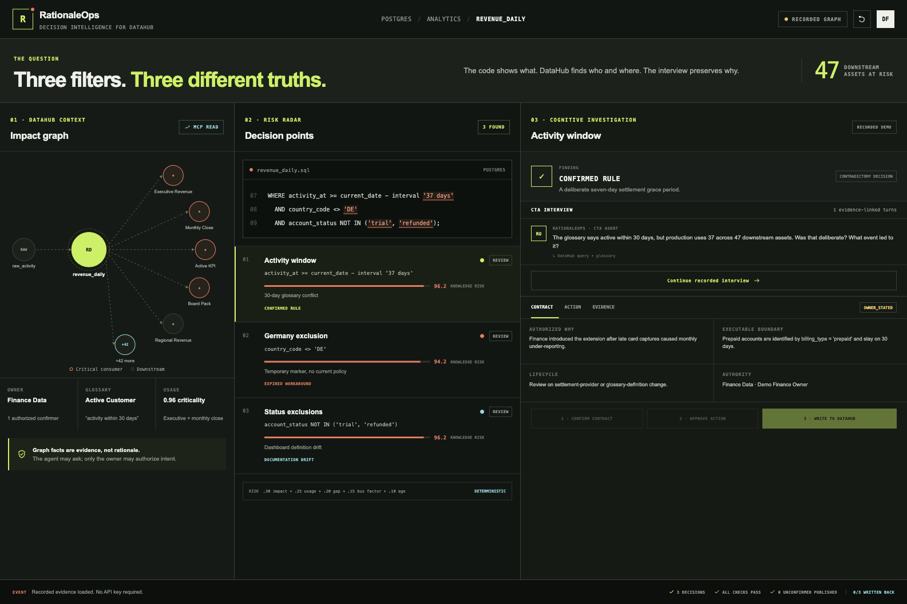
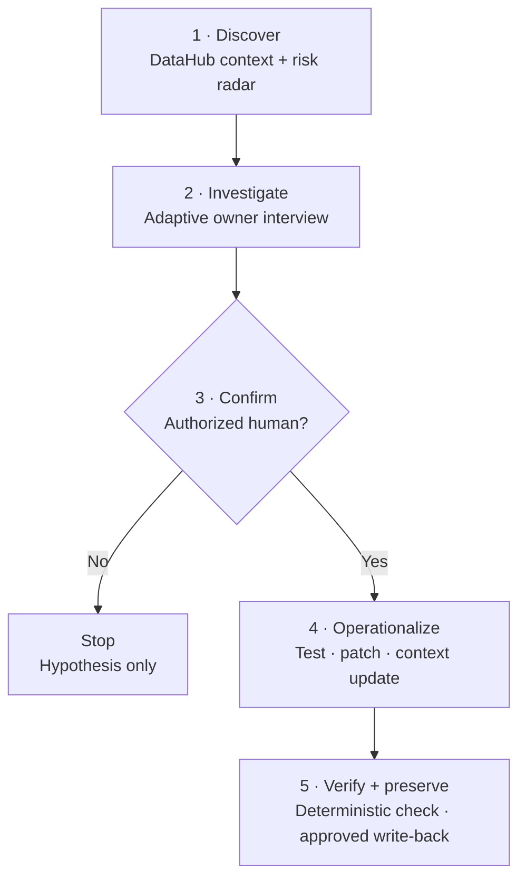
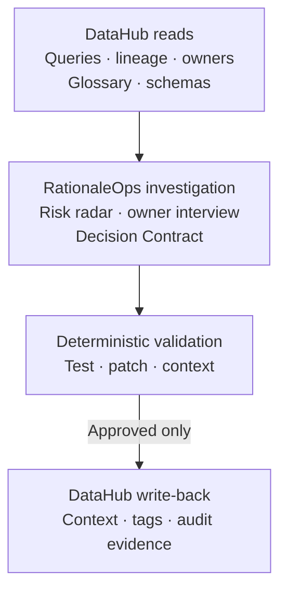
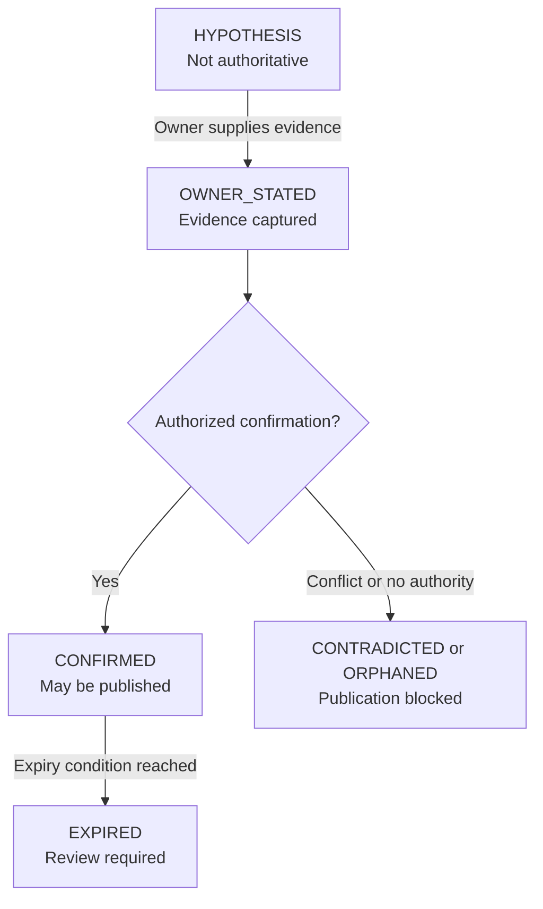

<div align="center">
  
  <h1>RationaleOps</h1>
  <p><strong>The code remembers what. RationaleOps preserves why.</strong></p>
  <p>
    A DataHub-grounded agent that finds high-impact decisions hidden in SQL,<br />
    interviews the people who understand them, and turns confirmed rationale<br />
    into living context, executable tests, and safe code repairs.
  </p>
  <p>
    <a href="https://barebone-lab.github.io/rationaleops/"><strong>Open dashboard</strong></a>
    ·
    <a href="video/out/rationaleops-demo.mp4"><strong>Watch the 120-second demo</strong></a>
    ·
    <a href="#quick-start"><strong>Run it locally</strong></a>
  </p>
  <p>
    <a href="https://github.com/barebone-lab/rationaleops/actions/workflows/ci.yml">
      
    </a>
    
    
    <a href="LICENSE">
      
    </a>
  </p>
</div>

<a href="https://barebone-lab.github.io/rationaleops/">
  
</a>

<p align="center"><em>Three filters. Three different truths. Click the dashboard to explore the recorded workflow.</em></p>

## The problem

> **Every strange filter is a rule, a workaround, or a bug. The code alone
> cannot tell you which.**

Data platforms can execute thousands of business rules that nobody can still
explain. Legacy filters survive after owners leave, definitions change, and
temporary workarounds quietly become permanent.

```sql
WHERE activity_at >= current_date - interval '37 days'
  AND country_code <> 'DE'
  AND account_status NOT IN ('trial', 'refunded')
```

Lineage shows where this logic flows. A parser identifies every predicate. But
neither can reliably explain why the window is 37 days, whether Germany should
still be excluded, which exceptions apply, or who has authority to approve a
change.

## At a glance

| | RationaleOps |
|---|---|
| **Finds** | Non-obvious SQL decisions with high usage, large blast radius, weak ownership, or stale rationale |
| **Grounds** | Every investigation in DataHub query history, lineage, ownership, schema, glossary, and documentation |
| **Asks** | Adaptive Cognitive Task Analysis questions about intent, cues, exceptions, counterfactuals, and expiry |
| **Produces** | A human-confirmed Decision Contract plus a validated test, context update, or repair proposal |
| **Protects** | Unconfirmed rationale never becomes authoritative context; every mutation requires explicit approval |

## How it works



```text
Detect → Prioritize → Hypothesize → Interview → Confirm → Operationalize → Verify → Preserve
```

## Three filters, three different truths

The recorded demo begins with one production model serving an executive revenue
dashboard and 47 downstream assets. Its three similar-looking predicates lead
to three different actions:

| Decision point | What the interview reveals | Safe outcome |
|---|---|---|
| `activity_at >= … '37 days'` | Finance deliberately added a seven-day settlement grace period; prepaid accounts remain on 30 days | **Confirmed rule** → Decision Contract and passing SQL acceptance test |
| `country_code <> 'DE'` | A temporary legal hold should have ended when the EU billing migration completed | **Expired workaround** → removal patch and sample regression validation |
| `account_status NOT IN (…)` | The implementation is correct, but the Active Customer definition is stale | **Documentation drift** → linked glossary and context update |

The visible result is not an AI-generated explanation. It is an
evidence-linked, owner-confirmed decision with lifecycle metadata and a
deterministically checked action.

## Quick start

The full recorded workflow needs neither an API key nor a live DataHub instance.

**Prerequisites:** Python 3.11 or newer and [`uv`](https://docs.astral.sh/uv/).

```bash
git clone https://github.com/barebone-lab/rationaleops.git
cd rationaleops
uv sync --dev --extra mcp
make demo
```

Expected result:

```text
Decision points found: 3
Outcomes: CONFIRMED_RULE, EXPIRED_WORKAROUND, DOCUMENTATION_DRIFT
Active-window test passes: True
Germany-removal patch passes: True
Documentation update valid: True
Recorded write-backs visible: True
```

Artifacts are written to `.rationaleops/full-demo/`. You can also inspect the
committed [recorded example](examples/recorded/summary.json).

<details>
<summary><strong>Run individual checks or install every workspace dependency</strong></summary>

```bash
# Mine the bundled SQL decision points
uv run rationaleops mine

# Run backend tests and linting
uv run pytest
uv run ruff check src tests

# Install Python, dashboard, MCP, and video dependencies
make setup

# Run the complete verification suite
make verify
```

Omit either approval flag from the underlying `demo-all` command to inspect the
corresponding safety gate. Recorded commands never read live DataHub
credentials.

</details>

## Why DataHub is essential

DataHub is not a decorative lookup or a lineage map redrawn in another UI. Its
graph acts as the evidence layer and risk radar for the investigation.



| DataHub provides | RationaleOps adds |
|---|---|
| **What** the SQL does | **Why** the organization chose it |
| **Where** the logic flows | **When** it expires or needs review |
| **Who** owns the affected assets | **Which** exceptions and evidence define its boundary |

The live path reads queries, lineage, entities, owners, glossary terms, and
schemas through the official DataHub MCP server. Approved context, status,
evidence, tags, and action receipts are written through the SDK or GraphQL and
then read back to verify preservation.

## Trust by design

> **The LLM discovers questions and structures answers. Humans authorize
> intent. Code verifies implementation.**



Only `CONFIRMED` content may become authoritative DataHub context. The system
also enforces these boundaries:

- Every material claim links to an interview turn or existing source.
- `unknown` is a valid answer; the model must not fill the gap.
- Conflicting evidence produces `CONTRADICTED`, not an LLM-selected winner.
- Tests, patches, and sample comparisons are deterministic.
- DataHub mutations require explicit, item-by-item approval.
- Recorded fixtures contain no production metadata or sensitive transcripts.

## Decision Contract

Every rationale is attached to the exact SQL fragment and a stable fingerprint.
It remains non-authoritative until an authorized person confirms it.

```yaml
id: decision-active-window-v1
status: CONFIRMED
implements:
  dataset_urn: urn:li:dataset:...
  sql_fingerprint: sha256:...
  sql_fragment: activity_at >= current_date - interval '37 days'
intent:
  goal: Prevent under-reporting caused by late card settlement
scope:
  excludes: prepaid accounts
exceptions:
  - when: billing_type = 'prepaid'
    behavior: use 30-day window
authority:
  owner: urn:li:corpGroup:finance-data
  confirmed_by: urn:li:corpuser:demo-owner
lifecycle:
  review_on:
    - settlement_provider_change
verification:
  tests:
    - tests/test_active_window.sql
```

## Run the live integrations

### DataHub OSS

Start DataHub, seed the demo graph idempotently, and prove the official MCP
reads:

```bash
datahub docker quickstart
uv run rationaleops seed-datahub
uv run rationaleops inspect-datahub
```

The expected context contains the production query, Finance owner, Active
Customer glossary term, schema fields, and exactly 47 downstream entities.

Publish one verified contract only after naming the exact item and authorized
approver:

```bash
uv run rationaleops writeback-datahub \
  --approve-contract decision-active-window-v1 \
  --approved-by urn:li:corpuser:demo-owner
```

The command reads the dataset back and fails unless the contract-specific state
is retrievable.

### API and dashboard

Run the stateful API:

```bash
uv run rationaleops-api
```

Then start the dashboard in a second terminal:

```bash
cd web
npm install
NEXT_PUBLIC_RATIONALEOPS_API_URL=http://127.0.0.1:8000 npm run dev
```

Without the API, the dashboard remains fully usable in deterministic recorded
mode. With the API connected, interviews, confirmations, artifact approvals,
and write-back receipts are persisted in SQLite.

### DeepSeek agent

RationaleOps uses DeepSeek V4-Pro through its OpenAI-compatible API:

```dotenv
DEEPSEEK_API_KEY=replace-with-your-deepseek-api-key
DEEPSEEK_BASE_URL=https://api.deepseek.com
DEEPSEEK_MODEL=deepseek-v4-pro
DEEPSEEK_THINKING_ENABLED=true
DEEPSEEK_REASONING_EFFORT=high
```

`.env` is ignored by Git. Never commit API keys, sensitive interviews,
production metadata, or private fixtures.

## What ships today

| Capability | Implementation |
|---|---|
| Deterministic SQL decision mining and stable fingerprints | SQLGlot-based miner |
| Transparent knowledge-risk ranking | Fixture-backed graph scoring |
| Adaptive owner interviews | Recorded and live DeepSeek paths |
| Authorization-gated Decision Contracts | Typed Pydantic models and transition guards |
| Operational actions | SQL tests, documentation updates, and repair patches |
| Deterministic verification | DuckDB tests and sample regression comparisons |
| DataHub integration | Official MCP reads plus SDK write/read verification |
| Interactive workflow | FastAPI, SQLite audit events, and a three-pane dashboard |
| Reproducible submission | GitHub Pages dashboard and a committed 120-second video |

See the complete [Definition of Done](DEVELOPMENT.md#20-definition-of-done) and
[test strategy](DEVELOPMENT.md#16-test-strategy).

## Repository map

```text
.
├── src/rationaleops/             # Agent workflow, contracts, integrations, and API
├── tests/                        # Unit and end-to-end safety tests
├── web/                          # Interactive dashboard and GitHub Pages build
├── video/                        # Remotion source and 120-second demo
├── skills/rationale-audit/       # Reusable DataHub rationale-audit skill
├── examples/recorded/            # Contracts, interviews, actions, and receipts
├── docs/                         # Hackathon brief and user-pain research
├── DEVELOPMENT.md                # Product and technical deep dive
├── Makefile                      # Setup, demo, verification, and run targets
└── pyproject.toml                # Python package and dependency metadata
```

## Hackathon alignment

RationaleOps was built for **Build with DataHub: The Agent Hackathon — Agents
That Do Real Work**.

<details>
<summary><strong>Open the official judging-criteria map</strong></summary>

| Criterion | Visible evidence | Repository evidence |
|---|---|---|
| **Use of DataHub** | Production query, 47-asset blast radius, owner and glossary grounding, approved write-back | [DataHub integration](DEVELOPMENT.md#7-datahub-integration) |
| **Technical Execution** | Typed mining-to-write-back loop, passing test, validated patch, and retrievable context | [Architecture](DEVELOPMENT.md#15-technical-architecture), [test strategy](DEVELOPMENT.md#16-test-strategy) |
| **Originality** | Cognitive Task Analysis elicits intent and exceptions that syntax cannot reveal | [Cross-disciplinary design](DEVELOPMENT.md#3-cross-disciplinary-design-cognitive-task-analysis) |
| **Real-World Usefulness** | One investigation separates a rule, expired workaround, and documentation drift | [Product problem](DEVELOPMENT.md#4-product-problem), [research](docs/USER_PAIN_RESEARCH.md) |
| **Submission Quality** | Hosted interactive dashboard, deterministic fixtures, and an under-three-minute demo | [Demo script](DEVELOPMENT.md#three-minute-script) |

The reusable contribution is an open `rationale-audit` DataHub skill, an open
Decision Contract format, and reproducible fixtures that other teams can extend.

</details>

## Documentation

- [Development and architecture](DEVELOPMENT.md)
- [Recorded example](examples/README.md)
- [Hackathon brief](docs/HACKATHON_BRIEF.md)
- [User-pain research](docs/USER_PAIN_RESEARCH.md)
- [Dashboard setup](web/README.md)
- [Demo video source](video/README.md)

## License

Licensed under the [Apache License 2.0](LICENSE).
