# RationaleOps

> **The code remembers what. RationaleOps preserves why.**

**Build with DataHub: The Agent Hackathon · Agents That Do Real Work**

RationaleOps finds high-impact business decisions hidden in SQL, interviews the people who understand them, and turns human-confirmed rationale into living DataHub context, executable tests, and safe code repairs.

**[Open the hosted dashboard](https://barebone-lab.github.io/rationaleops/)** · **[Watch the 120-second demo](video/out/rationaleops-demo.mp4)**

## Judge Quick Scan

| In 15 seconds | RationaleOps |
|---|---|
| **Real problem** | Data platforms can execute thousands of rules that nobody can still explain. Legacy filters survive after owners leave, definitions change, and temporary workarounds expire. |
| **What DataHub contributes** | Query history identifies real production SQL; lineage measures blast radius; ownership finds the right expert; glossary and documentation expose conflicts; approved rationale is written back to the graph. |
| **What the agent does** | It mines a high-risk SQL decision point, conducts an adaptive Cognitive Task Analysis interview, obtains human confirmation, and creates a test, documentation update, or repair proposal. |
| **Why an LLM is essential** | Syntax cannot reveal whether a rule is policy, workaround, or bug. The agent must understand vague explanations, domain language, exceptions, contradictions, temporal scope, and counterfactuals. |
| **Visible wow moment** | Three similar filters become three different cards: `CONFIRMED RULE`, `EXPIRED WORKAROUND`, and `DOCUMENTATION DRIFT`, followed by a passing test, a validated patch, and DataHub write-back. |
| **Trust model** | The LLM asks and structures. An authorized human confirms intent. Deterministic code verifies implementation. |

## The One-Line Problem

> **Every strange filter is a rule, a workaround, or a bug. The code alone cannot tell you which.**

Consider a model used by an executive revenue dashboard and 47 downstream assets:

```sql
WHERE activity_at >= current_date - interval '37 days'
  AND country_code <> 'DE'
  AND account_status NOT IN ('trial', 'refunded')
```

Lineage can show where this logic flows. A SQL parser can identify every predicate. Neither can reliably answer:

- Why 37 days instead of the 30-day glossary definition?
- Is the Germany exclusion permanent or tied to a completed migration?
- Does the active-customer definition contain exceptions?
- Who approved each decision?
- When does it expire, and which test proves the code still matches its intent?

This missing `WHY` is institutional knowledge. Today it is recovered through expensive workshops, code archaeology, scattered messages, or the memory of a person who may already have left.

## The 45-Second Demo Story

The demo begins with the three SQL filters above. They look almost identical. RationaleOps uses DataHub to show their shared 47-asset blast radius and locate the responsible owner.

During a live adaptive interview:

1. **37-day activity window → `CONFIRMED RULE`**

   Finance introduced a seven-day settlement grace period. A follow-up question uncovers a prepaid-account exception. RationaleOps creates a Decision Contract and dbt test.

2. **Germany exclusion → `EXPIRED WORKAROUND`**

   A legal hold was meant to last only until an EU billing migration completed. It ended last month. RationaleOps generates a removal patch and validates the downstream sample diff.

3. **Trial and refund exclusion → `DOCUMENTATION DRIFT`**

   The SQL is correct, but the active-customer glossary entry is stale. RationaleOps proposes a linked context update rather than changing code.

The closing screen shows the approved rationale, owner, evidence, lifecycle, test result, and repair status written back to DataHub.

## Official Judging Criteria Alignment

These are the five official criteria recorded in the local [Hackathon Brief](docs/HACKATHON_BRIEF.md#5-judging-criteria). Each row maps a criterion to visible demo evidence and detailed repository evidence.

| Official criterion | What RationaleOps demonstrates | Concrete demo evidence | Repository evidence |
|---|---|---|---|
| **Use of DataHub** | DataHub is not a decorative lookup. Query history, table and column lineage, ownership, schemas, glossary, documentation, tags, and structured properties drive candidate selection, risk ranking, interview grounding, and write-back. | Show the exact production query, 47 downstream assets, owner resolution, glossary conflict, and approved rationale visible after write-back. | [DataHub integration](DEVELOPMENT.md#7-datahub-integration), [agent workflow](DEVELOPMENT.md#6-agent-workflow) |
| **Technical Execution** | A complete typed loop combines deterministic SQL AST mining, transparent graph-based ranking, a multi-turn agent, evidence-linked states, human approval, test or patch generation, deterministic validation, and DataHub mutation. | Start with raw SQL and finish with a valid Decision Contract, passing dbt test, validated patch, and retrievable DataHub context. | [Technical architecture](DEVELOPMENT.md#15-technical-architecture), [test strategy](DEVELOPMENT.md#16-test-strategy), [Decision Contract](DEVELOPMENT.md#11-decision-contract) |
| **Originality** | RationaleOps applies Cognitive Task Analysis and the Critical Decision Method—used to elicit tacit expertise in high-risk domains—to decision points discovered through data lineage. It closes the gap between executable `WHAT` and authorized `WHY`. | The agent does not explain SQL generically. It asks incident, cue, exception, expiry, and counterfactual probes that change according to the owner's answers. | [Cross-disciplinary design](DEVELOPMENT.md#3-cross-disciplinary-design-cognitive-task-analysis), [user-pain research](docs/USER_PAIN_RESEARCH.md) |
| **Real-World Usefulness** | The product targets undocumented business logic, metric disagreement, owner departure, stale context, and temporary workarounds that quietly become permanent. It prioritizes the few interviews with the largest risk reduction. | One interview prevents an incorrect glossary update, identifies an expired production filter, and preserves an exception as an executable regression test. | [Product problem](DEVELOPMENT.md#4-product-problem), [official and community evidence](docs/USER_PAIN_RESEARCH.md) |
| **Submission Quality** | The story is intentionally visual: three similar filters become three distinct outcomes. Every action has evidence, status, and a visible before-and-after result. | The first 15 seconds state the problem; the first 90 seconds reveal three outcome cards; the final minute shows action, validation, and DataHub write-back. | [Three-minute script](DEVELOPMENT.md#three-minute-script), [golden-demo invariant](DEVELOPMENT.md#golden-demo-invariant) |

### Open-Source Contribution Bonus

The planned reusable contribution is a DataHub **rationale-audit Skill** plus an open Decision Contract schema and reproducible demo fixtures. These artifacts let other DataHub users detect undocumented decision points and add their own interview and approval workflows.

## Why This Is Not Another Lineage Map

DataHub already captures and displays lineage. RationaleOps treats that graph as a risk radar rather than redrawing it.

| Existing capability | What it answers | What remains unresolved |
|---|---|---|
| SQL parsing | Which predicates, joins, constants, and branches exist? | Why were they chosen? |
| Lineage | Which assets depend on this transformation? | Is the decision still valid? |
| Ownership | Who is responsible for the asset? | What does that person know that was never written down? |
| Glossary and documentation | What definition is currently recorded? | Is it authoritative, stale, incomplete, or contradicted by implementation? |
| AI-generated documentation | What does the model infer the code probably does? | Which intent has been confirmed by someone with authority? |

RationaleOps begins where the map stops:

```text
DataHub:      WHAT changed, WHERE it flows, WHO owns it
RationaleOps: WHY it exists, WHEN it expires, WHICH exceptions apply
```

## Why This Cannot Be Simple Automation

| Deterministic code | DeepSeek V4-Pro agent | Human authority |
|---|---|---|
| Parse SQL and produce stable fingerprints | Explain a decision point in domain language | Confirm or correct business intent |
| Calculate usage and downstream blast radius | Interpret vague answers and terminology | Identify the true approving authority |
| Detect documentation gaps and literal conflicts | Ask adaptive exception and counterfactual questions | Resolve organizational disagreement |
| Validate a generated test or patch | Structure evidence into a typed draft | Approve publication or code change |

The safety boundary is explicit:

> **The LLM discovers questions and structures answers. Humans authorize intent. Code verifies implementation.**

## End-to-End Architecture

```mermaid
flowchart LR
    A["DataHub query history, lineage, schema, owners, glossary"] --> B["Deterministic SQL decision-point miner"]
    B --> C["Transparent knowledge-risk ranking"]
    C --> D["DeepSeek V4-Pro agent"]
    D --> E["Adaptive CTA / CDM interview"]
    E --> F["Evidence-linked Decision Contract draft"]
    F --> G["Human confirmation"]
    G --> H["Test, context update, or repair proposal"]
    H --> I["Deterministic validation"]
    I --> J["Approved DataHub write-back"]
    J --> K["Expiry and drift revalidation"]
```



```text
Detect → Prioritize → Hypothesize → Interview → Confirm → Operationalize → Verify → Preserve
```

## DataHub Integration Depth

### Reads through MCP Server or Agent Context Kit

| DataHub capability | Product use |
|---|---|
| Dataset queries and query history | Retrieve production SQL, usage evidence, filters, joins, and `CASE` expressions |
| Table and column lineage | Calculate blast radius and connect a decision to dashboards and models |
| Entity metadata | Read owners, descriptions, terms, tags, and structured properties |
| Schema fields | Ground the interview and validate referenced columns and types |
| Search | Find related rules, duplicated literals, glossary terms, and conflicting assets |

### Approved writes through SDK or GraphQL

- Linked Context Document or equivalent documentation aspect.
- Decision status, owner, evidence, effective date, expiry, and review trigger.
- Glossary-definition proposal.
- `RationaleVerified` or `RationaleNeedsReview` tag.
- Test, assertion, repair, and audit evidence linked to affected assets.

The golden path requires at least one real DataHub mutation and a subsequent read proving that the context was preserved.

## Decision Contract and Truth States

Every rationale is attached to an exact SQL fingerprint and remains non-authoritative until approved.

```yaml
id: decision-active-window-v1
status: CONFIRMED
implements:
  dataset_urn: urn:li:dataset:...
  sql_fingerprint: sha256:...
  sql_fragment: activity_at >= current_date - interval '37 days'
intent:
  goal: Prevent under-reporting caused by late card settlement
scope:
  excludes: prepaid accounts
exceptions:
  - when: billing_type = 'prepaid'
    behavior: use 30-day window
authority:
  owner: urn:li:corpGroup:finance-data
  confirmed_by: urn:li:corpuser:demo-owner
lifecycle:
  review_on:
    - settlement_provider_change
verification:
  tests:
    - tests/test_active_window.sql
```

Truth states prevent plausible model output from silently becoming policy:

- `HYPOTHESIS`
- `OWNER_STATED`
- `CONFIRMED`
- `CONTRADICTED`
- `EXPIRED`
- `ORPHANED`

Only `CONFIRMED` content may become authoritative DataHub context.

## Safety and Evaluation

- No human evidence and confirmation means no published rationale.
- Every material claim points to an interview turn or existing source.
- `unknown` is a valid answer; the model must not fill the gap.
- Conflicting owners produce `CONTRADICTED`, not an LLM-selected winner.
- Code patches remain drafts until tests, linting, compilation, and sample comparisons pass.
- DataHub mutations require explicit, item-by-item approval.
- Sensitive transcripts and production metadata must not enter public fixtures or logs.
- A deterministic recorded mode keeps the judge demo reproducible without an API key.

The golden-demo invariant is:

```text
decision_points_found = 3
outcomes = {CONFIRMED_RULE, EXPIRED_WORKAROUND, DOCUMENTATION_DRIFT}
unconfirmed_rationale_published = 0
generated_test_passes = true
expired_workaround_patch_passes = true
datahub_write_back_visible = true
```

## Implementation Status

The complete three-outcome workflow runs in deterministic recorded mode and has
also been verified against a live local DataHub OSS graph and the live DeepSeek
API. Recorded fixtures remain clearly labelled; they are not used as evidence
for the live integration checks.

- [x] Validated problem and evidence base
- [x] Hackathon requirements and official scoring map
- [x] Product architecture, trust boundary, and typed contract design
- [x] Reproducible hero scenario and three-minute script
- [x] DeepSeek V4-Pro configuration
- [x] Bundled query, glossary, owner, and 47-downstream recorded fixture
- [x] SQLGlot decision-point miner with stable fingerprints
- [x] Transparent fixture-backed knowledge-risk ranker
- [x] Adaptive recorded CTA interviews for all three rules
- [x] Typed Decision Contract and authorization-gated confirmation
- [x] SQL acceptance-test generation and DuckDB validation
- [x] Separate approval gate plus recorded write/read verification
- [x] Three-outcome recorded fallback with committed sample outputs
- [x] Live DataHub SDK writer implementation
- [x] Seeded 47-asset DataHub OSS graph
- [x] Official DataHub MCP reads for query, lineage, entity, owner, glossary, and schema
- [x] Live DeepSeek V4-Pro adaptive interview path with typed JSON output
- [x] FastAPI + SQLite workflow and audit-event persistence
- [x] Interactive three-pane web confirmation and evidence interface
- [x] Germany-removal repair generation and sample regression validation
- [x] Explicitly approved real DataHub write-back and read-after-write verification
- [x] Reusable `rationale-audit` DataHub skill
- [x] GitHub Pages hosted dashboard
- [x] Final browser demo recording and under-three-minute video

Progress is measured against the full [Definition of Done](DEVELOPMENT.md#20-definition-of-done).

## Repository Layout

```text
.
├── DEVELOPMENT.md                 # Product, architecture, demo, and implementation plan
├── src/rationaleops/
│   ├── mining.py                  # Deterministic SQL AST candidate extraction
│   ├── risk.py                    # Transparent knowledge-risk formula
│   ├── interview.py               # Recorded adaptive CTA workflow
│   ├── contracts.py               # Contract drafting and truth-state guards
│   ├── artifacts.py               # SQL test generation and execution
│   ├── datahub_mcp.py             # Official MCP server read adapter
│   ├── datahub_seed.py            # Idempotent 47-asset DataHub demo seeder
│   ├── datahub_gateway.py         # Approval-gated SDK write adapter
│   ├── llm.py                     # Typed DeepSeek CTA agent
│   ├── storage.py                 # SQLite workflow and event persistence
│   ├── service.py                 # Interactive trust-boundary service
│   ├── api.py                     # FastAPI application
│   └── full_workflow.py           # Complete three-outcome orchestration
├── web/                           # Interactive dashboard and GitHub Pages build
├── video/                         # Remotion source and 120-second MP4 demo
├── skills/rationale-audit/        # Reusable DataHub rationale-audit skill
├── tests/                         # Unit and end-to-end safety tests
├── examples/recorded/             # Three contracts, transcripts, actions, and receipts
├── docs/
│   ├── HACKATHON_BRIEF.md         # Rules, deliverables, and judging criteria
│   └── USER_PAIN_RESEARCH.md      # Official and community evidence
├── .env.example                   # Safe local configuration template
├── main.py                        # CLI-compatible development entry point
└── pyproject.toml                 # Python project metadata
```

## Local Setup

Prerequisites:

- Python 3.11 or newer
- [`uv`](https://docs.astral.sh/uv/)
- Node.js 22.13 or newer for the dashboard
- A local or reachable DataHub OSS instance for live integration
- A DeepSeek API key for live LLM calls

Install every Python, dashboard, MCP, and video dependency in one command:

```bash
git clone https://github.com/barebone-lab/rationaleops.git
cd rationaleops
make setup
```

This also creates `.env` from the safe example when it does not already exist.
Add credentials only when using the live integrations.

Equivalent manual setup:

```bash
uv sync --dev --extra mcp
cp .env.example .env
npm --prefix web ci
npm --prefix video ci
```

The full recorded demo needs neither a DeepSeek key nor a live DataHub. The two
approval flags cover validated recorded actions and in-memory fixture writes
only:

```bash
make demo
# or
uv run rationaleops demo-all \
  --approve-actions \
  --approve-writeback
```

Expected result:

```text
Decision points found: 3
Outcomes: CONFIRMED_RULE, EXPIRED_WORKAROUND, DOCUMENTATION_DRIFT
Active-window test passes: True
Germany-removal patch passes: True
Documentation update valid: True
Recorded write-backs visible: True
```

Artifacts are written to `.rationaleops/full-demo/`. Inspect the committed
[recorded example](examples/recorded/summary.json), mine the bundled SQL, or run
the full suite:

```bash
make verify
# or run individual checks
uv run rationaleops mine
uv run pytest
uv run ruff check src tests
uv build
```

Omit either approval flag to inspect the corresponding safety gate. Recorded
commands never read live DataHub credentials.

### Live DataHub OSS path

Start DataHub OSS, seed the graph idempotently, and prove the official MCP reads:

```bash
datahub docker quickstart
uv run rationaleops seed-datahub
uv run rationaleops inspect-datahub
```

The expected MCP context contains the production query, Finance owner, Active
Customer glossary term, schema fields, and exactly 47 downstream entities.

Publish one verified contract only after naming the exact item and authorized
approver:

```bash
uv run rationaleops writeback-datahub \
  --approve-contract decision-active-window-v1 \
  --approved-by urn:li:corpuser:demo-owner
```

The command reads the dataset back and fails unless the contract-specific state
is retrievable.

### API and dashboard

Run the stateful local API:

```bash
uv run rationaleops-api
```

In a second terminal:

```bash
cd web
npm install
NEXT_PUBLIC_RATIONALEOPS_API_URL=http://127.0.0.1:8000 npm run dev
```

The dashboard remains fully usable in recorded mode when no backend or LLM key
is available. With the API connected, confirmations, artifact approvals,
interview turns, and write-back receipts are persisted in SQLite.

The public GitHub Pages dashboard is available at
<https://barebone-lab.github.io/rationaleops/>.

### Demo video

The committed 120-second text-led walkthrough uses screenshots from the real
dashboard and remains reproducible from its Remotion source:

```bash
cd video
npm install
npm run render
```

The rendered submission is [`video/out/rationaleops-demo.mp4`](video/out/rationaleops-demo.mp4).

## LLM Configuration

RationaleOps uses DeepSeek V4-Pro through the OpenAI-compatible DeepSeek API:

```dotenv
DEEPSEEK_API_KEY=replace-with-your-deepseek-api-key
DEEPSEEK_BASE_URL=https://api.deepseek.com
DEEPSEEK_MODEL=deepseek-v4-pro
DEEPSEEK_THINKING_ENABLED=true
DEEPSEEK_REASONING_EFFORT=high
```

`.env` is ignored by Git. Never commit API keys, interview transcripts, production metadata, or sensitive fixtures.

## Documentation

- [Development plan](DEVELOPMENT.md)
- [Hackathon brief](docs/HACKATHON_BRIEF.md)
- [User-pain research](docs/USER_PAIN_RESEARCH.md)

## License

Licensed under the [Apache License 2.0](LICENSE).
